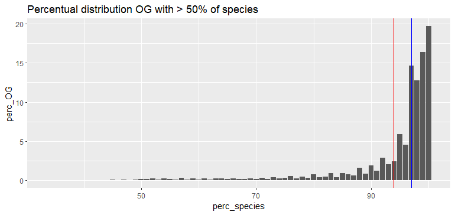
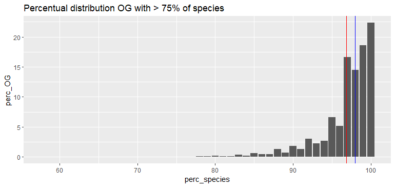

# Orthology inference

## [Orthofinder](https://github.com/davidemms/OrthoFinder)

We inferred orthology using BUSCO (v 2.5.5).

```bash
orthofinder -f <folder_proteomes> -s <cladogram> -t <n_CPUs>
```

We found 18673 orthogroups and 313 of these were single and complete. 99.0% of all genes were assigned to an orthogroup. The median of orthogroup size was 134 genes, the mean 115. The G50 all genes was 141 (50% of genes are in orthogroups of size 141 or larger) and the O50 all genes 4987 (the 4987 biggest orthogroups, 26.7% of total orthogroups, contain 50% of all genes). We could say it was a good OrthoFinder run.

## Paralogs filtering

Programs that study convergence, like TRACCER, use as input orthogroups. Since only 313 were true single copy, we needed to increase this number elaborating OGs present in the folder "Orthogroup_Sequences". It is not uncommon that during orthology inference using graphs that paralogs are incorporated into orthogroups, since the programs use sequence similarity.

## Filter

As first thing, we calculated precise statistics of our OGs, computing the presence percentage of LL, SL, and NL species, the total species one, and if there was at least one species being part of the internal outgroup (Drnov, Cacas, and Stcam).

We first created a new file, aves_LID.txt (LID = longevity ID (SL - short lived, LL- long lived, NL - normal lived)) elaborating aves_table. Sepcific threshold were applied to specify LQ intervals for each LID. In particular:

- long-lived species (LL) present LQ values greater or equal to 2.
- normal-lived species (NL) present LQ values between, but not inlcuded, 2 and 0.5.
- short-lived species (SL) presnet LQ values smaller or equal to 0.5.

All that was implemented in [count_perc_species_OG](./Scripts/count_perc_species_OG.sh) script.

We then created a couple of histograms using as input `species_perc_OG.txt` where we could display the percentage of species present in those OGs that had in them at least a precise percentage (we decided to confront 75% and 50%) of both LL and SL species, 50% of the total species, and at least one species from the outgroup.

|                                                                                  |                                                                                                                                 |
|----------------------------------------------------------------------------------|-----------------------------------------------------------------------------------|
|||

In these histograms we can appreciate mean (red) and median (blue) of these distribution. In total we have 11988 OGs for 50% threshold and 10591 OGs for 75% one. Clearly the lower the threshold the more OGs we can collect. A great news was that a big amount of OGs contained high numbers of species.

Since we thought that OGs with at least 50% of LL and SL species were sufficently informative, we decided to use them, continuing the analyses on them.

At that point we had OG sequences and gene trees of every OG that contained at least 50% of LL, SL, and total species and at least one species forming outgroup. The next step was to filter OGs since they were not single-copy. To filter them we decided to use a pipeline based on [DISCO](https://github.com/JSdoubleL/DISCO).

### DISCO

The main aim of DISCO (v1.3.1) is to prune gene trees in order to eliminate paralogs branches and obtain the biggest tree with single sequences. After the installment of required dependecies (TreeSwift and argparse) we ran [DISCO.py](https://github.com/JSdoubleL/DISCO/blob/master/disco.py). As inputs, we used simple gene tree, and not resolved ones, since it was a more direct Orthofinder output and did not present any elaboration that sometimes can change the informativity of the tree. We decided to maitain every tree and pruned subtree that counted at least 70 species.

```bash
for tree in *_tree.txt; do python3 disco.py -i "$tree" -o <output>_disco_tree.txt -d "|" -m 70 --keep-labels; done 2>/dev/null

# -m 70 means that we wanted to retain only those tree that presented at least 70 species.
# -d is the delimiter between the species name and the sequence name
# --keep-labels is needed since we are using it improperly, so we need to keep every sequence name to recreate OGs at the end of the process.
# 2>/dev/null it redirects the stderr to be eliminated
```

The main problem is that this program is not made for our purpose: obtaining new OGs sequences. Thus, we extracted from each tree we obtained the group of sequences that composed its tips. In order to do it we created a script [split_disco_output](./Scripts/split_disco_output.sh) that we runned inside our disco folder. Finally, we had to create orthogroups from this trees. To do so, we used [recreate_disco_ortho.sh](./Scripts/recreate_disco_ortho.sh). Since we provided as Orthofinder inputs genomes already oneline, we used directly raw orthogroups to recreate the polished one inferred with DISCO.

We obtained 13584 OGs. Again, we used the same threshold (50% of total species presence, 50% of both SL and LL species presence, and at least one outgroup species) to determine which OGs should be maintained or eliminated. We first run [count_perc_species_OG](./Scripts/count_perc_species_OG.sh), computing general presence statics in our OGs. Then we selected only those OGs that fulfilled our claims and the number of OGs decreased to 12399.

## Results

As before, we than selected and used for subsequent passages OGs that maitained at least half of the total species, half of SL and LL species, and one species being part of the outgroup (LID50_TOT50_out filter - short LT50o).

The following table resume numbers we obtained after these polishing passages

| Passage                    | OG_number |
|----------------------------|:---------:|
| Orthofinder_output         |   18673   |
| Orthofinder filter         |   10591   |
| Raw DISCO output           |   13584   |
| DISCO filter               |   12399   |
| DISCO trimmed and filtered |   12322   |
